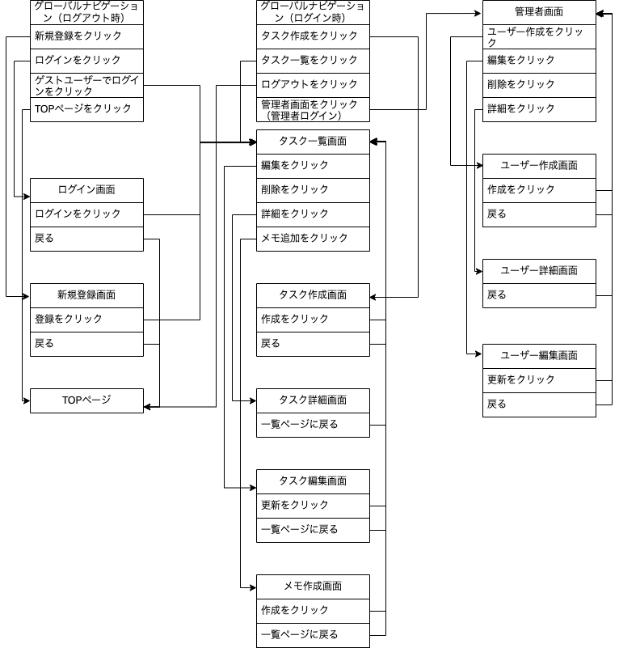

# README

### 開発言語
- Ruby3.0.1
- Rails6.1.7

### 就業Termの技術
- devise
- AWS EC2

### カリキュラム外の技術
- Vue.jsを用いたSPA

### 実行手順
```
$ git clone git@github.com:tomoki4321/okan_task.git
$ cd okan_task
$ bundle install
$ yarn install
$ rails db:create && rails db:migrate
$ rails s
```

### カタログ設計

https://docs.google.com/spreadsheets/d/1zq1YKt7NgdfnzZ5ppQDITs7NEfcclKncmY9Aiy8iD40/edit?usp=sharing

### テーブル定義書

https://docs.google.com/spreadsheets/d/1zq1YKt7NgdfnzZ5ppQDITs7NEfcclKncmY9Aiy8iD40/edit?usp=sharing

### ワイヤーフレーム

https://cacoo.com/diagrams/MdVU2qMdp4nXSkha/7F53F

### ER図


### 画面遷移図


